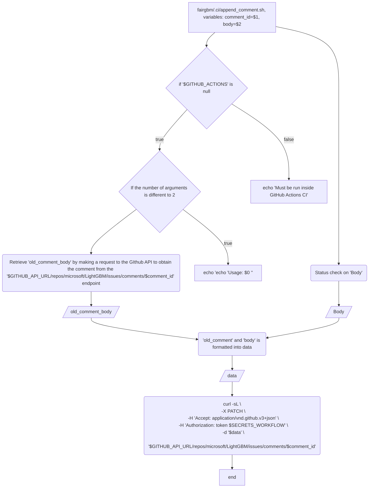
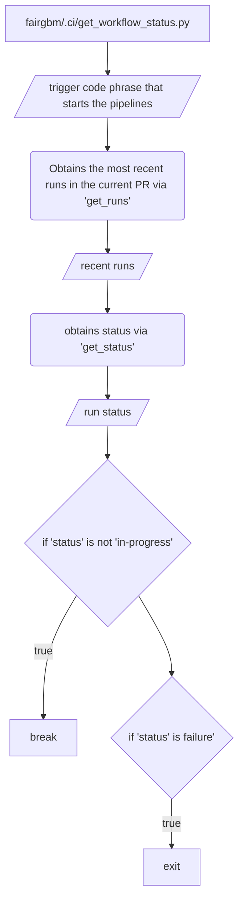
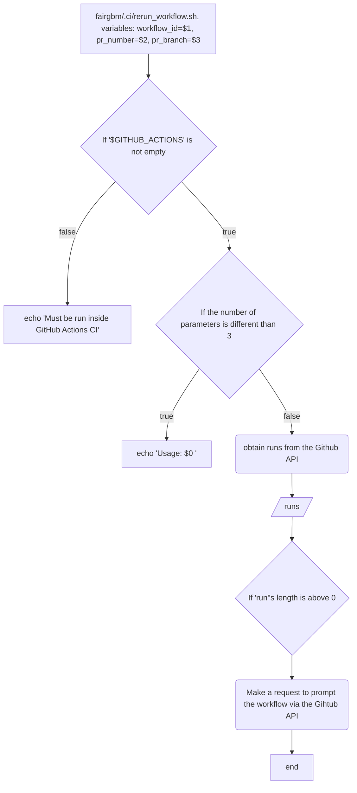
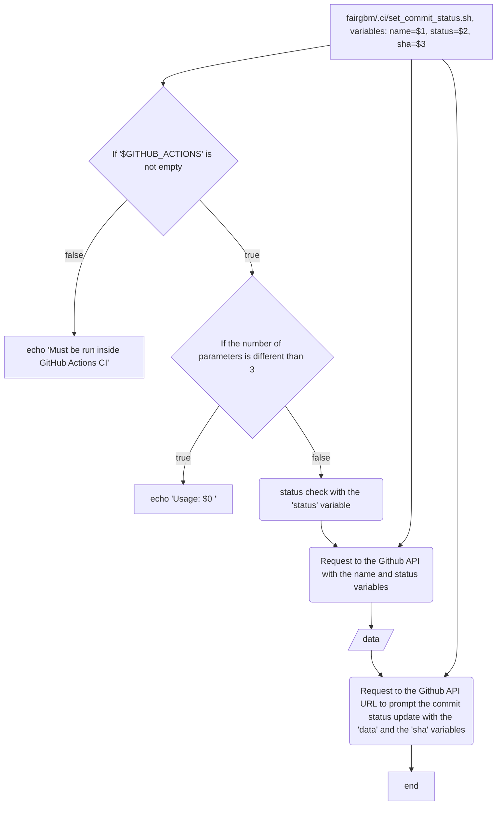
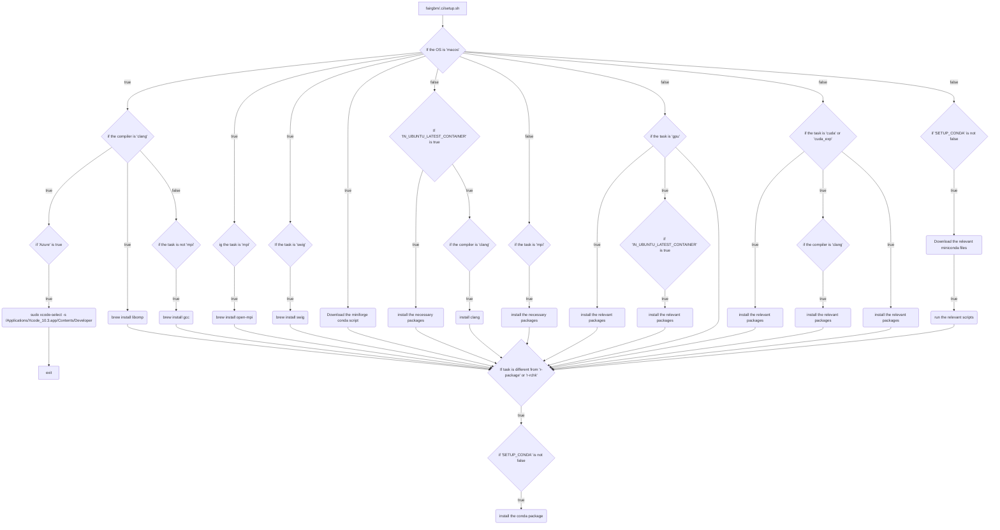

# CI Scripts Documentation

This document describes the shell scripts and utilities used by the continuous integration workflows in the FairGBM project. These scripts handle setup, testing, and workflow orchestration across different platforms and build configurations. They are primarily called by the GitHub Actions workflows documented in [ci_workflows_docs.md](./ci_workflows_docs.md).

The documentation below showcases each CI script's functionality.

## append_comment.sh
This script allows for updating a GitHub issue/PR comment by appending new text to an existing comment. It retrieves the original comment via the GitHub API, formats the new content, and patches the comment with the combined text.

## fairgbm/.ci/get_workflow_status.py

## fairgbm/.ci/install_opencl.ps1
Perform the OpenCL Installation

## fairgbm/.ci/lint_r_code.R
Linting utility for R code

## fairgbm/.ci/rerun_workflow.sh
Made to rerun a given workflow inside a pull request

## fairgbm/.ci/run_rhub_solaris_checks.R
Run Solaris checks

## fairgbm/.ci/set_commit_status.sh
Set a status with a given name to the specified commit.

## fairgbm/.ci/setup.sh
Setup script for different platforms

## fairgbm/.ci/test.sh
Runs the test scripts for the different platforms and tasks

## fairgbm/.ci/test_r_package.sh, fairgbm/.ci/test_r_package_valgrind.sh, fairgbm/.ci/test_r_package_windows.ps1 and fairgbm/.ci/test_windows.ps1
These are test scripts for R in different platforms.

## fairgbm/.ci/trigger_dispatch_run.sh
Trigger manual workflow run by a dispatch event.

## Scripts Status and Maintenance Notes

### Legacy Scripts
The following scripts reference the original LightGBM repository and may be candidates for removal or adaptation:
- **append_comment.sh** - References `microsoft/LightGBM` in API calls; may not be actively used in FairGBM workflows
- **get_workflow_status.py** - May be legacy from LightGBM fork
- **rerun_workflow.sh** - Check if still used in current CI pipelines
- **run_rhub_solaris_checks.R** - Solaris support may not be required for FairGBM